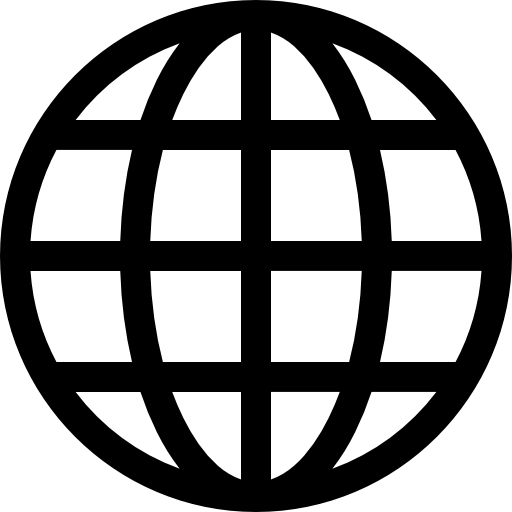

# Nick The Moon :new_moon:

Hi there I am an new Dev I was trying to work with lua in Roblox I already made some projects.

----

    

        
        Roblox projects
    

see the:
<a href= "https://github.com/Nick-The-Moon/portfolio">
3 in 1 open source
</a>    

---
#  social medias

  

    
     
     

